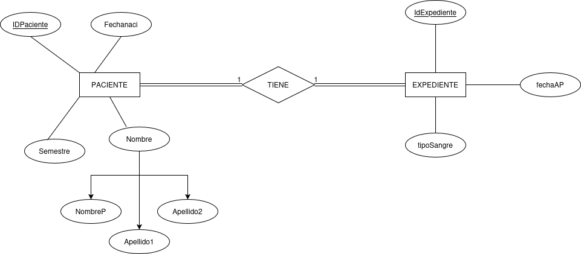
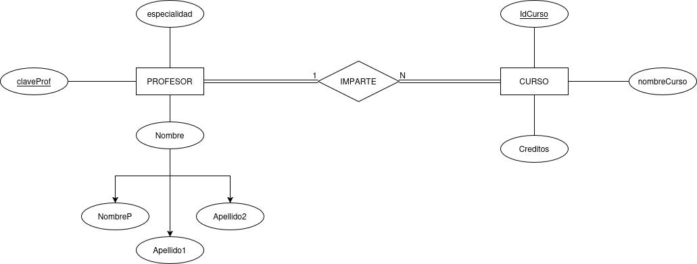
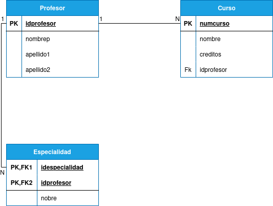
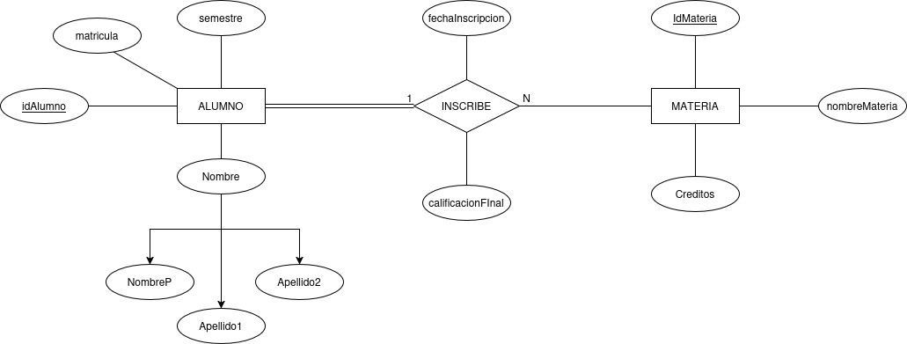
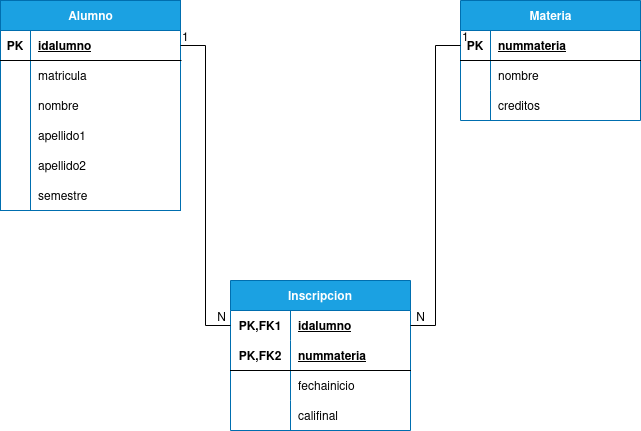
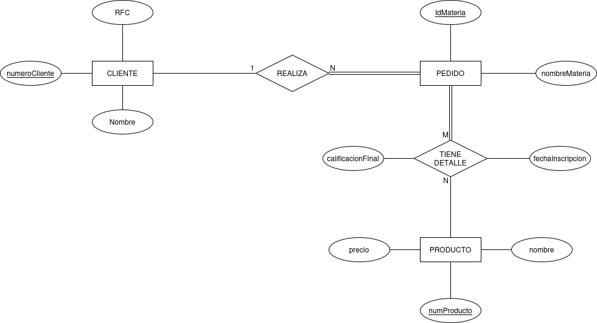
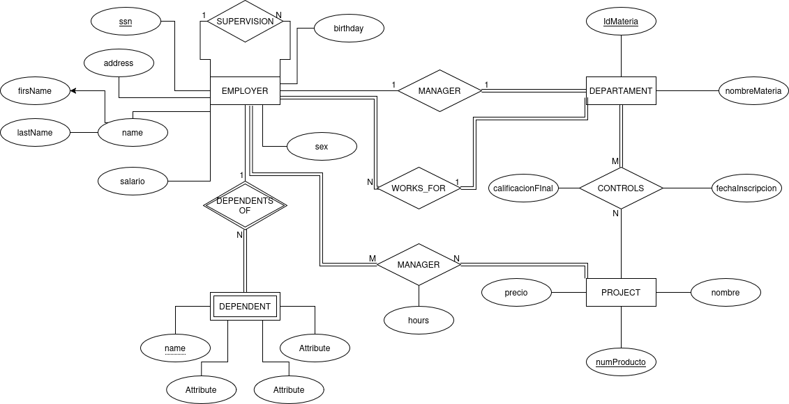

# Ejercicios del modelo entidad relacion

1. ejercicio 1-Hospital
## modelo E-R

## Modelo relacional
.png)

2. ejercicio 2
## modelo E-R

## Modelo relacional

3. ejercicio 3
## modelo E-R

## Modelo relacional

4. ejercicio 4
## modelo E-R

## Modelo relacional

5. ejercicio 5
## modelo E-R

## Modelo relacional
.png)