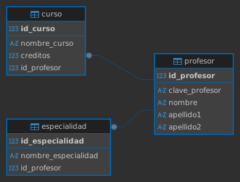

## Ejercicio 2 Universidad

```sql
/* ================
 	crear a la Base de datos
 ================== */

CREATE DATABASE control_universidad;

/* ==================
	usar la base de datos
===================== */

USE control_universidad;

/* =====================
    Crear tabla profesor
===================== */

CREATE TABLE profesor(
	id_profesor INT NOT NULL IDENTITY(1,1),
	clave_profesor VARCHAR(15) NOT NULL,
	nombre VARCHAR(30) NOT NULL,
	apellido1 VARCHAR(50) NOT NULL,
	apellido2 VARCHAR(50) NULL,
	
	CONSTRAINT pk_profesor
	PRIMARY KEY (id_profesor),
	CONSTRAINT uq_profesor_clave_profesor
	UNIQUE (clave_profesor)
);

/* =====================
    Crear tabla especialidad
===================== */

CREATE TABLE especialidad(
	id_especialidad INT NOT NULL IDENTITY(1,1),
	nombre_especialidad VARCHAR(100) NOT NULL,
	id_profesor INT NOT NULL,
	
	CONSTRAINT pk_especialidad
	PRIMARY KEY (id_especialidad),
	CONSTRAINT fk_especialidad_profesor
	FOREIGN KEY (id_profesor)
	REFERENCES profesor(id_profesor)
);

/* =====================
    Crear tabla curso
===================== */

CREATE TABLE curso(
	id_curso INT NOT NULL IDENTITY(1,1),
	nombre_curso VARCHAR(100) NOT NULL,
	creditos INT NOT NULL,
	id_profesor INT NOT NULL,
	
	CONSTRAINT pk_curso
	PRIMARY KEY (id_curso),
	CONSTRAINT  ck_curso_creditos
	CHECK (creditos > 0),
	CONSTRAINT fk_curso_profesor
	FOREIGN KEY (id_profesor)
	REFERENCES profesor(id_profesor)
);
```

## diagrama de la base de datos
