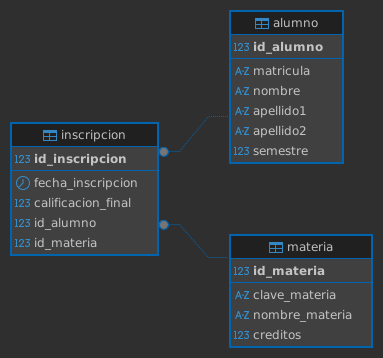

# Ejercicio 3 control escolar

```sql
/* =====================
    Crear base de datos
===================== */

CREATE DATABASE control_escolar;

/* =====================
    Usar base de datos
===================== */

USE control_escolar;

/* =====================
    Crear tabla alumno
===================== */

CREATE TABLE alumno(
	id_alumno INT NOT NULL IDENTITY(1,1),
	matricula VARCHAR(15) NOT NULL,
	nombre VARCHAR(30) NOT NULL,
	apellido1 VARCHAR(50) NOT NULL,
	apellido2 VARCHAR(50) NULL,
	semestre INT NOT NULL,
	
	CONSTRAINT pk_alumno
	PRIMARY KEY (id_alumno),
	CONSTRAINT uq_alumno_matricula
	UNIQUE (matricula),
	CONSTRAINT ck_alumno_semestre
	CHECK (semestre > 0)
);

/* =====================
    Crear tabla materia
===================== */

CREATE TABLE materia(
	id_materia INT NOT NULL IDENTITY(1,1),
	clave_materia VARCHAR(15) NOT NULL,
	nombre_materia VARCHAR(100) NOT NULL,
	creditos INT NOT NULL,

	CONSTRAINT pk_materia
	PRIMARY KEY (id_materia),
	CONSTRAINT uq_materia_clave_materia
	UNIQUE (clave_materia),
	CONSTRAINT ck_materia_creditos
	CHECK (creditos > 0)
);

/* =====================
    Crear tabla inscripcion
===================== */

CREATE TABLE inscripcion(
	id_inscripcion INT NOT NULL IDENTITY(1,1),
	fecha_inscripcion DATETIME2 NOT NULL
	CONSTRAINT df_inscripcion_fecha_inscripcion
	DEFAULT SYSDATETIME(),
	calificacion_final DECIMAL(10,2) NOT NULL,
	id_alumno INT NOT NULL,
	id_materia INT NOT NULL,
	
	CONSTRAINT pk_inscripcion
	PRIMARY KEY (id_inscripcion),
	CONSTRAINT ck_inscripcion_calificacion_final
	CHECK (calificacion_final >= 0.0 AND calificacion_final <=10.0),
	CONSTRAINT fk_inscripcion_alumno
	FOREIGN KEY (id_alumno)
	REFERENCES alumno(id_alumno),
	CONSTRAINT fk_inscripcion_materia
	FOREIGN KEY (id_materia)
	REFERENCES materia(id_materia)
);
```

## Diagrama de la base de datos
